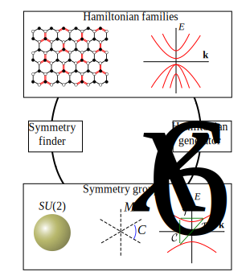

# Qsymm

**Symmetry finder and symmetric Hamiltonian generator**

`qsymm` is an [open-source](LICENSE) Python library that makes symmetry analysis simple.

It automatically generates model Hamiltonians from symmetry constraints and finds the full symmetry group of your Hamiltonian.

Check out the introductory [example notebook](basics.ipynb) to see examples of how to use `qsymm`.

## Implemented algorithms



The two core concepts in `qsymm` are _Hamiltonian families_ (Hamiltonians that may depend on free parameters) and _symmetries_. We provide powerful classes to handle these:

+ `Model` is used to store symbolic Hamiltonians that may depend on momenta and other free parameters. We use `sympy` for symbolic manipulation, but our implementation utilizes `numpy` arrays for efficient calculations with matrix valued functions.

+ `PointGroupElement` and `ContinuousGroupGenerator` are used to store symmetry operators. Besides the ability to combine symmetries, they can also be applied to a `Model` to transform it.

We implement algorithms that form a two-way connection between Hamiltonian families and symmetries.

+ Symmetry finding is handled by `symmetries`, it takes a `Model` as input and finds all of its symmetries, including conserved quantities, time reversal, particle-hole, and spatial rotation symmetries. See [`symmetry_finder.ipynb`](symmetry_finder.ipynb) and [`kekule.ipynb`](kekule.ipynb) for detailed examples.

+ `continuum_hamiltonian` and `bloch_family` are used to generate __k.p__ or lattice Hamiltonians from symmetry constraints. See [`kdotp_generator.ipynb`](kdotp_generator.ipynb), [`bloch_generator.ipynb`](bloch_generator.ipynb) and [`kekule.ipynb`](kekule.ipynb) for detailed examples.

## Installation
`qsymm` works with Python 3.5 and is available on PyPI:
```bash
pip install qsymm
```

Some of the example notebooks also require [Kwant](https://kwant-project.org/).

## Development
`qsymm` is on [Gitlab](https://gitlab.kwant-project.org/qt/qsymm), visit there if you would like to to contribute, report issues, or get the latest development version.

### Making a release

#### Ensure that all tests pass

#### Tag the release

Make an **annotated** tag for the release. The tag must be the version number prefixed by the letter 'v':
```
git tag v<version> -m "version <version>"
```

#### Build a source tarball and wheels and test it

```
rm -fr build dist
python setup.py sdist bdist_wheel
```

This creates the file `dist/qsymm-<version>.tar.gz`.  It is a good idea to unpack it
and check that the tests run:
```
tar xzf dist/qsymm*.tar.gz
cd qsymm-*
py.test .
```

#### Create an empty commit for new development and tag it
```
git commit --allow-empty -m 'start development towards v<version+1>'
git tag -am 'Start development towards v<version+1>' v<version+1>-dev
```

Where `<version+1>` is `<version>` with the minor version incremented
(or major version incremented and minor and patch versions then reset to 0).
This is necessary so that the reported version for any further commits is
`<version+1>-devX` and not `<version>-devX`.


### Publish the release

#### Push the tags
```
git push origin v<version> v<version+1>-dev
```

#### Upload to PyPI
```
twine upload dist/*
```

